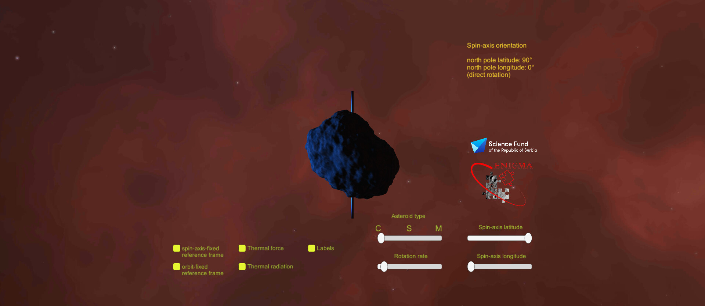

# Yarkovsky Effect in Virtual Reality
Interactive VR simulation and Android game explaining Yarkovsky effect on asteroids

 



## 🔭 Project Overview

**Yarkovsky Effect in Virtual Reality** is an immersive VR and Android-based simulation designed to visualize the Yarkovsky effect — a subtle non-gravitational force that plays a critical role in the long-term orbital evolution of small Solar System bodies.
The project was developed within **Project ENIGMA**, supported by the **Science Fund of the Republic of Serbia**, with the goal of improving conceptual understanding of complex asteroid dynamics by translating numerical and theoretical models into an interactive 3D environment.

## 📦 Installation Guide

This application is distributed as a pre-compiled binary (`.apk`) for Meta Quest standalone headsets.

#### Prerequisites
* **Hardware:** Meta Quest 2, Quest 3, or Quest Pro.
* **Mode:** Developer Mode enabled (via Meta Horizon app).
* **Connection:** USB cable.

#### Option 1: SideQuest
1. Download the latest `.apk` from **[Releases](https://github.com/dusanmarceta/Yarkovsky-Effect-in-Virtual-Reality/releases)**.
2. Drag and drop the file into the **SideQuest** install window.

#### Option 2: ADB
1. If you do not have Android Platform Tools installed:
* Download **SDK Platform-Tools** from [developer.android.com](https://developer.android.com/tools/releases/platform-tools).
* Extract the folder.
* Place the `Yarkovsky_VR.apk` file inside the extracted `platform-tools` folder.
2. Open a terminal (Command Prompt/PowerShell) in that folder and run:

```bash
./adb install -r Yarkovsky_VR.apk
```
